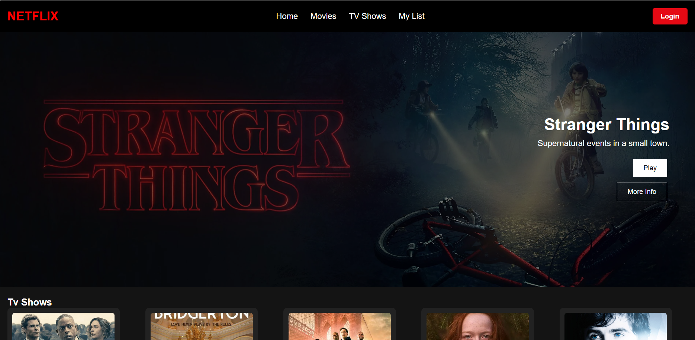
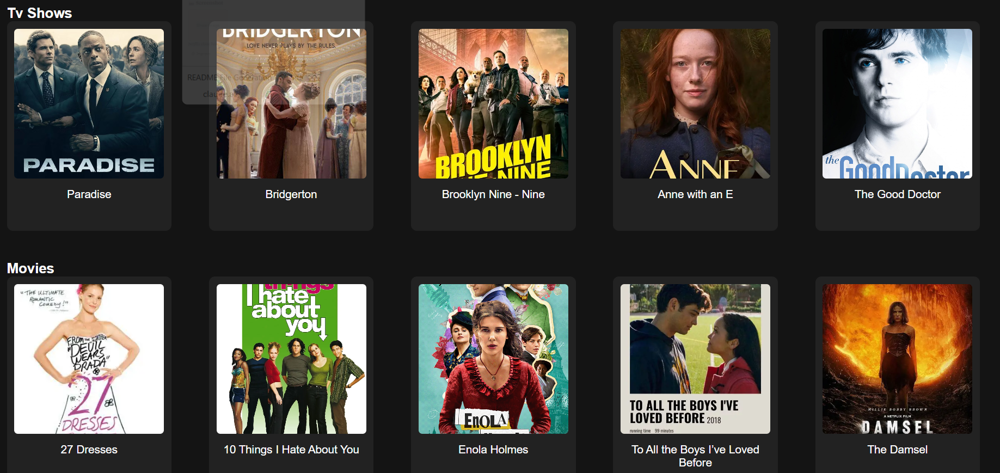

# Netflix Clone

A simple, responsive Netflix clone built with HTML, CSS, and JavaScript. This project recreates the basic UI and functionality of Netflix's homepage, featuring a hero section, movie/TV show categories, and interactive elements.

## 🎬 Features

- **Responsive Design**: Works on desktop and mobile devices
- **Hero Section**: Featured content with play and info buttons
- **Movie Categories**: Organized sections for TV Shows, Movies, and Trending content
- **Interactive Elements**: Clickable movie cards and navigation buttons
- **Netflix-like Styling**: Dark theme with red accents matching Netflix's brand
- **Hover Effects**: Smooth animations and transitions for better user experience

## 🚀 Demo

The application displays:
- A navigation header with Netflix branding
- Hero section featuring "Stranger Things"
- Three content rows: TV Shows, Movies, and Trending
- Interactive movie cards with hover effects
- Footer with copyright information

## 📸 Screenshot






## 📁 Project Structure

```
netflix-clone/
│
├── index.html          # Main HTML structure
├── style.css           # Styling and responsive design
├── script.js           # JavaScript functionality
└── README.md           # Project documentation
```

## 🛠️ Technologies Used

- **HTML5**: Semantic markup and structure
- **CSS3**: Styling, flexbox layout, and animations
- **JavaScript**: DOM manipulation and event handling
- **External Images**: Movie posters and background images

## 🎯 Usage

- **Navigation**: Use the header navigation to browse different sections
- **Hero Section**: Click "Play" or "More Info" buttons for alerts
- **Movie Cards**: Click on any movie/TV show card to see its title
- **Login**: Click the login button to see a redirect message


## 📱 Responsive Design

The application is designed to work on various screen sizes:
- **Desktop**: Full layout with all features
- **Tablet**: Adjusted spacing and layout
- **Mobile**: Responsive navigation and card grid

## 🌟 Key Features Implementation

### Hero Section
- Background image with overlay
- Positioned content with call-to-action buttons
- Responsive text sizing

### Movie Grid
- Flexbox layout with wrapping
- Fixed card dimensions for consistency
- Hover animations for interactivity

### Navigation
- Sticky header with brand logo
- Navigation links and login button
- Responsive design considerations

## 🚧 Future Enhancements

- [ ] Add video playback functionality
- [ ] Login and sign up page
- [ ] Add subscription plans page with pricing tiers
- [ ] Implement user authentication
- [ ] Add search and filter capabilities
- [ ] Include movie details modal
- [ ] Add favorites/watchlist functionality
- [ ] Implement carousel/slider for movie rows
- [ ] Add loading states and error handling
- [ ] Include rating system
- [ ] Add more responsive breakpoints


